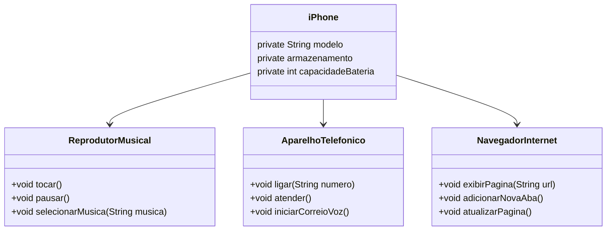

# Modelando o iPhone com UML: Funções de Músicas, Chamadas e Internet

### Repositório criado para o desafio do bootcamp Santander 2024 - Backend com Java

     
    O objetivo do desafio proposto é modelar e diagramar a representação UML do componente iPhone, abrangendo suas funcionalidades como Reprodutor Musical, Aparelho Telefônico e Navegador na Internet.
     

<h4>Contexto</h4>

    Com base no vídeo de lançamento do iPhone de 2007 <a href="https://www.youtube.com/watch?v=9ou608QQRq8">(Link)</a>, elaborei a diagramação das classes e interfaces utilizando mermaid. Em seguida, implementei as classes e interfaces no formato de arquivos .java.

#### Funcionalidades a Modelar
1. **Reprodutor Musical**
   - Métodos: `tocar()`, `pausar()`, `selecionarMusica(String musica)`
2. **Aparelho Telefônico**
   - Métodos: `ligar(String numero)`, `atender()`, `iniciarCorreioVoz()`
3. **Navegador na Internet**
   - Métodos: `exibirPagina(String url)`, `adicionarNovaAba()`, `atualizarPagina()`

### Objetivo
1. Criar um diagrama UML que represente as funcionalidades descritas acima.
2. Implementar as classes e interfaces correspondentes em Java.

### Diagrama UML para o desafio proposto (Mermaid)

